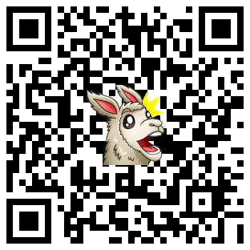

# [Live Demo](https://dvillasmil08.github.io/dvillasmil.github.io/)

## [Resume](https://drive.google.com/file/d/1klPCUAwcq1CgzSZnlAY4V9tiKCKYIxL7/view)

# Portfolio Project README

## Project Overview

This repository contains my portfolio project, which showcases my skills, experience, and projects I have worked on. The project is live and can be accessed [here]([https://www.example.com](https://dvillasmil08.github.io/dvillasmil/)). 

## Table of Contents

- [Project Overview](#project-overview)
- [Installation](#installation)
- [Usage](#usage)
- [Technologies Used](#technologies-used)
- [Contributing](#contributing)
- [Contact](#contact)

## Installation

To run this project locally, follow these steps:

1. Clone the repository: `git clone https://github.com/your-username/portfolio-project.git`
2. Change into the project directory: `cd portfolio-project`
3. Install project dependencies: `npm install`

## Usage

To use the project, follow these steps:

1. Start the development server: `npm start`
2. Open your browser and navigate to `http://localhost:3000`

## Technologies Used

- HTML
- CSS
- React.js

## Contributing

If you would like to contribute to this project, you can follow these steps:

1. Fork the repository.
2. Create a new branch: `git checkout -b feature/your-feature`
3. Make your changes and commit them: `git commit -m 'Add some feature'`
4. Push the changes to your branch: `git push origin feature/your-feature`
5. Open a pull request on GitHub.

## Contact

If you have any questions or feedback regarding this project, please reach me at [dvillasmil08@gmail.com](mailto:dvillasmil08@gmail.com).
